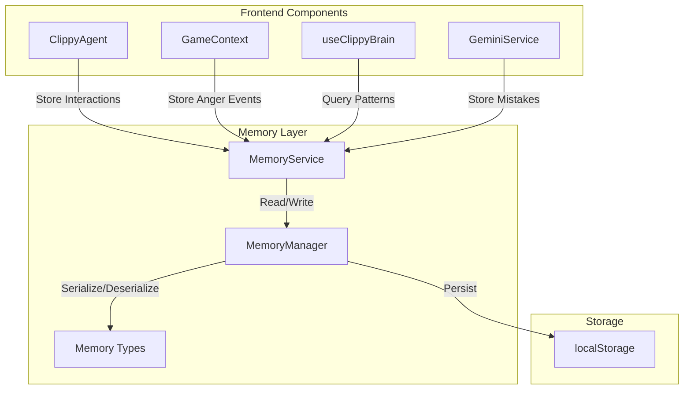

# Design Document

## Overview

The Clippy Memory System provides persistent storage and retrieval of user behavior data across sessions. It integrates with the existing GameContext, ClippyAgent, and backend services to create a comprehensive memory layer that enables Clippy to reference past mistakes, recognize patterns, and maintain continuity in interactions.

The system uses a layered architecture with a centralized MemoryService that manages all storage operations, a TypeScript-based data model for type safety, and localStorage as the persistence backend. The design prioritizes simplicity, performance, and seamless integration with existing components.

## Architecture

### System Components



### Data Flow

1. **Write Path**: Component → MemoryService → MemoryManager → localStorage
2. **Read Path**: localStorage → MemoryManager → MemoryService → Component
3. **Initialization**: localStorage → MemoryManager → Hydrate State → Components

### Integration Points

- **GameContext**: Hooks into anger level changes and error count updates
- **ClippyAgent**: Stores interaction history when displaying messages
- **useClippyBrain**: Queries memory for behavioral context
- **GeminiService**: Records mistakes when linting errors are detected
- **Backend Services**: Can optionally sync memory data for cross-device persistence (future enhancement)

## Components and Interfaces

### 1. Memory Data Models

**File**: `src/types/memory.ts`

```typescript
/**
 * A recorded mistake from linting or validation
 */
export interface MistakeRecord {
  id: string;
  errorType: string; // e.g., "missing-semicolon", "undefined-variable"
  message: string;
  location: {
    file: string;
    line: number;
  };
  timestamp: number;
  count: number; // How many times this exact error has occurred
}

/**
 * A recognized code pattern
 */
export interface CodePattern {
  id: string;
  name: string; // e.g., "camelCase-functions", "no-semicolons"
  description: string;
  frequency: number; // Percentage (0-100)
  lastSeen: number;
  examples: string[]; // Sample code snippets
}

/**
 * A recorded interaction with Clippy
 */
export interface InteractionRecord {
  id: string;
  type: 'roast' | 'compliment' | 'help' | 'warning' | 'punishment';
  message: string;
  timestamp: number;
  context?: {
    angerLevel?: number;
    errorCount?: number;
  };
}

/**
 * Anger level history entry
 */
export interface AngerEvent {
  level: number;
  timestamp: number;
  trigger?: string; // What caused the anger change
}

/**
 * Statistics about anger levels
 */
export interface AngerStats {
  totalDeaths: number; // Times BSOD was triggered
  highestLevel: number;
  averageLevel: number;
  levelCounts: Record<number, number>; // Count per level (0-5)
  timeAtLevel: Record<number, number>; // Milliseconds spent at each level
}

/**
 * Complete user memory profile
 */
export interface UserMemory {
  version: string; // Schema version for migrations
  userId: string; // Generated on first use
  createdAt: number;
  lastUpdated: number;
  
  mistakes: MistakeRecord[];
  patterns: CodePattern[];
  interactions: InteractionRecord[];
  angerHistory: AngerEvent[];
  angerStats: AngerStats;
}
```

### 2. MemoryManager

**File**: `src/utils/memoryManager.ts`

Handles low-level storage operations, serialization, and data validation.

```typescript
export class MemoryManager {
  private static readonly STORAGE_KEY = 'clippy_memory';
  private static readonly MAX_STORAGE_SIZE = 5 * 1024 * 1024; // 5MB limit
  
  /**
   * Load memory from localStorage
   */
  static load(): UserMemory | null;
  
  /**
   * Save memory to localStorage
   */
  static save(memory: UserMemory): boolean;
  
  /**
   * Check if localStorage is available
   */
  static isStorageAvailable(): boolean;
  
  /**
   * Get current storage size in bytes
   */
  static getStorageSize(): number;
  
  /**
   * Clear all memory data
   */
  static clear(): void;
  
  /**
   * Create a new empty memory profile
   */
  static createEmpty(): UserMemory;
  
  /**
   * Validate memory data structure
   */
  static validate(data: unknown): data is UserMemory;
}
```

### 3. MemoryService

**File**: `src/services/memoryService.ts`

High-level API for components to interact with memory. Manages in-memory state and synchronization.

```typescript
export class MemoryService {
  private memory: UserMemory;
  private syncTimer: NodeJS.Timeout | null = null;
  private isDirty: boolean = false;
  
  constructor() {
    // Load from storage or create new
    this.memory = MemoryManager.load() || MemoryManager.createEmpty();
  }
  
  // === Mistake Management ===
  
  /**
   * Record a new mistake or increment count if it exists
   */
  recordMistake(errorType: string, message: string, file: string, line: number): void;
  
  /**
   * Get all common mistakes (occurred 3+ times)
   */
  getCommonMistakes(): MistakeRecord[];
  
  /**
   * Get mistake count for a specific error type
   */
  getMistakeCount(errorType: string): number;
  
  /**
   * Get all mistakes, optionally filtered by error type
   */
  getMistakes(errorType?: string): MistakeRecord[];
  
  // === Pattern Management ===
  
  /**
   * Analyze code and update pattern statistics
   */
  analyzeCodePatterns(code: string, filename: string): void;
  
  /**
   * Get favorite patterns (frequency > 50%)
   */
  getFavoritePatterns(): CodePattern[];
  
  /**
   * Get all patterns
   */
  getPatterns(): CodePattern[];
  
  // === Interaction Management ===
  
  /**
   * Record a new interaction
   */
  recordInteraction(
    type: InteractionRecord['type'],
    message: string,
    context?: InteractionRecord['context']
  ): void;
  
  /**
   * Get recent interactions
   */
  getRecentInteractions(limit?: number): InteractionRecord[];
  
  /**
   * Get interactions by type
   */
  getInteractionsByType(type: InteractionRecord['type']): InteractionRecord[];
  
  // === Anger Management ===
  
  /**
   * Record an anger level change
   */
  recordAngerChange(level: number, trigger?: string): void;
  
  /**
   * Get anger statistics
   */
  getAngerStats(): AngerStats;
  
  /**
   * Get anger history
   */
  getAngerHistory(limit?: number): AngerEvent[];
  
  // === Utility ===
  
  /**
   * Force save to localStorage
   */
  flush(): void;
  
  /**
   * Get memory summary for debugging
   */
  getSummary(): {
    totalMistakes: number;
    commonMistakes: number;
    totalPatterns: number;
    totalInteractions: number;
    totalDeaths: number;
  };
  
  /**
   * Clear all memory (nuclear option)
   */
  reset(): void;
}

// Singleton instance
export const memoryService = new MemoryService();
```

### 4. Memory Context (Optional)

**File**: `src/contexts/MemoryContext.tsx`

React context wrapper for easy access to memory service in components.

```typescript
interface MemoryContextType {
  service: MemoryService;
  summary: ReturnType<MemoryService['getSummary']>;
  refresh: () => void;
}

export const MemoryProvider: React.FC<{ children: ReactNode }>;
export const useMemory: () => MemoryContextType;
```

## Data Models

### Storage Schema

```typescript
{
  version: "1.0.0",
  userId: "uuid-v4",
  createdAt: 1701234567890,
  lastUpdated: 1701234567890,
  
  mistakes: [
    {
      id: "uuid",
      errorType: "missing-semicolon",
      message: "Missing semicolon",
      location: { file: "main.js", line: 42 },
      timestamp: 1701234567890,
      count: 5
    }
  ],
  
  patterns: [
    {
      id: "uuid",
      name: "camelCase-functions",
      description: "Uses camelCase for function names",
      frequency: 85,
      lastSeen: 1701234567890,
      examples: ["function getUserData()", "function handleClick()"]
    }
  ],
  
  interactions: [
    {
      id: "uuid",
      type: "roast",
      message: "It looks like you're trying to write code...",
      timestamp: 1701234567890,
      context: { angerLevel: 2, errorCount: 3 }
    }
  ],
  
  angerHistory: [
    {
      level: 2,
      timestamp: 1701234567890,
      trigger: "syntax-error"
    }
  ],
  
  angerStats: {
    totalDeaths: 3,
    highestLevel: 4,
    averageLevel: 1.5,
    levelCounts: { 0: 100, 1: 50, 2: 30, 3: 10, 4: 5, 5: 3 },
    timeAtLevel: { 0: 300000, 1: 150000, 2: 90000, 3: 30000, 4: 15000, 5: 0 }
  }
}
```

### Pattern Detection Algorithms

**Naming Conventions**:
- Analyze function/variable names for camelCase, snake_case, PascalCase
- Track consistency percentage

**Code Style**:
- Semicolon usage (always, never, inconsistent)
- Indentation (spaces vs tabs, 2 vs 4)
- Quote style (single, double, backticks)

**Comment Frequency**:
- Comments per 100 lines of code
- JSDoc usage percentage

**Error Patterns**:
- Most common error types
- Time-of-day error frequency
- Error clustering (multiple errors in short time)

## Error Handling

### Storage Failures

```typescript
try {
  MemoryManager.save(memory);
} catch (error) {
  if (error instanceof QuotaExceededError) {
    // Storage full - archive old data
    this.archiveOldData();
    this.retry();
  } else {
    // Log error and continue in memory-only mode
    console.warn('Memory persistence disabled:', error);
    this.memoryOnlyMode = true;
  }
}
```

### Data Corruption

```typescript
const loaded = MemoryManager.load();
if (!MemoryManager.validate(loaded)) {
  console.warn('Corrupted memory data, resetting');
  MemoryManager.clear();
  return MemoryManager.createEmpty();
}
```

### Migration Strategy

```typescript
function migrate(data: any): UserMemory {
  const version = data.version || '0.0.0';
  
  if (version === '1.0.0') {
    return data as UserMemory;
  }
  
  // Apply migrations sequentially
  let migrated = data;
  if (semver.lt(version, '1.0.0')) {
    migrated = migrateToV1(migrated);
  }
  
  return migrated;
}
```

## Testing Strategy

### Unit Tests

**File**: `src/services/memoryService.test.ts`

- Test CRUD operations for each data type
- Test storage limits and cleanup
- Test pattern detection algorithms
- Test data validation and migration
- Mock localStorage for isolation

**File**: `src/utils/memoryManager.test.ts`

- Test serialization/deserialization
- Test storage availability detection
- Test quota exceeded handling
- Test data corruption recovery

### Integration Tests

**File**: `src/integration/memory-integration.test.ts`

- Test GameContext → MemoryService integration
- Test ClippyAgent → MemoryService integration
- Test cross-component data flow
- Test localStorage persistence across "sessions" (component remounts)

### Manual Testing Scenarios

1. **Mistake Tracking**: Write code with repeated errors, verify counts increase
2. **Pattern Recognition**: Write code in consistent style, verify patterns detected
3. **Interaction History**: Trigger various Clippy messages, verify history stored
4. **Anger Tracking**: Trigger anger level changes, verify stats updated
5. **Persistence**: Refresh page, verify all data restored
6. **Storage Limits**: Fill storage to capacity, verify graceful degradation

## Performance Considerations

### Debouncing

- Sync to localStorage every 500ms (not on every change)
- Use `requestIdleCallback` for non-critical updates

### Data Limits

- Maximum 100 mistake records (FIFO cleanup)
- Maximum 50 interaction records (rolling window)
- Maximum 20 code patterns
- Maximum 200 anger events (archive older than 30 days)

### Optimization

```typescript
// Lazy loading
const patterns = useMemo(() => 
  memoryService.getFavoritePatterns(), 
  [lastPatternUpdate]
);

// Batch updates
memoryService.batch(() => {
  recordMistake(...);
  recordInteraction(...);
  recordAngerChange(...);
});
```

## Integration Examples

### GameContext Integration

```typescript
// In GameContext.tsx
import { memoryService } from '../services/memoryService';

const setAngerLevel = (level: number) => {
  const prevLevel = angerLevelRef.current;
  angerLevelRef.current = level;
  
  // Record in memory
  if (level !== prevLevel) {
    memoryService.recordAngerChange(level, 'user-action');
  }
  
  // Check for BSOD
  if (level >= 5) {
    memoryService.recordAngerChange(5, 'bsod-triggered');
  }
};
```

### ClippyAgent Integration

```typescript
// In ClippyAgent.tsx
import { memoryService } from '../services/memoryService';

const speak = (text: string, type: InteractionRecord['type']) => {
  // Show message
  setGeminiFeedback(text);
  
  // Record interaction
  memoryService.recordInteraction(type, text, {
    angerLevel: anger,
    errorCount: errors?.length || 0
  });
};
```

### GeminiService Integration

```typescript
// In geminiService.ts or linting flow
import { memoryService } from '../services/memoryService';

export async function getClippyFeedback(code: string, language: string) {
  const response = await fetch(...);
  const data = await response.json();
  
  // Record mistakes
  if (data.errors) {
    data.errors.forEach(error => {
      memoryService.recordMistake(
        error.type || 'unknown',
        error.message,
        activeFile || 'unknown',
        error.line
      );
    });
  }
  
  return data;
}
```

### useClippyBrain Integration

```typescript
// In useClippyBrain.ts
import { memoryService } from '../services/memoryService';

// Use memory for contextual behavior
useEffect(() => {
  const commonMistakes = memoryService.getCommonMistakes();
  const recentInteractions = memoryService.getRecentInteractions(3);
  
  // Adjust behavior based on history
  if (commonMistakes.length > 5) {
    // User is a repeat offender, be more aggressive
    playAnimationWithTier('GetAttention', TIER.ACTIVE);
  }
}, [errorCount]);
```

## Future Enhancements

### Backend Sync (Optional)

- Add API endpoints for memory sync
- Enable cross-device memory persistence
- Implement conflict resolution for concurrent edits

### Advanced Analytics

- Visualize mistake trends over time
- Show "coding report card" to user
- Predict likely errors based on patterns

### Social Features

- Compare stats with other users (anonymized)
- Leaderboard for "most deaths"
- Share funny roasts

### AI-Powered Insights

- Use Gemini to analyze patterns and suggest improvements
- Generate personalized coding tips based on history
- Predict when user is about to make a common mistake
