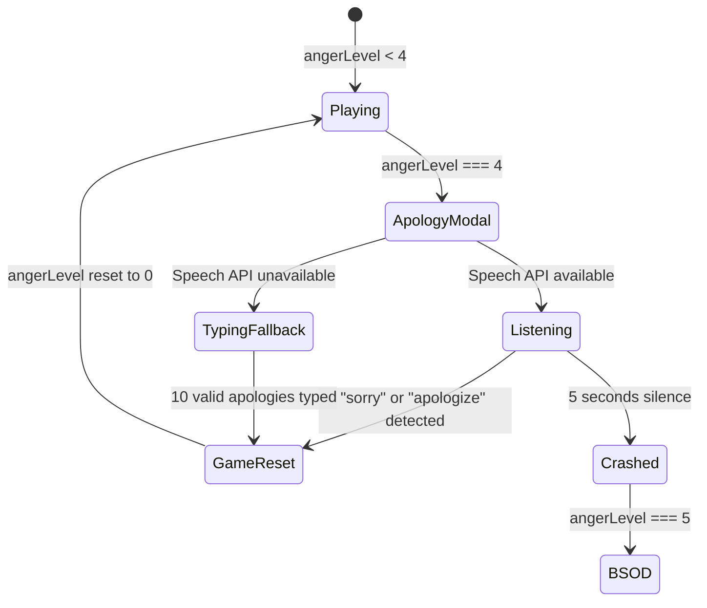

# Design Document: Voice Apology System

## Overview

The Voice Apology System introduces a critical intervention point in the game flow that occurs when Clippy's anger reaches level 4 (just before the crash at level 5). The system presents an `ApologyModal` component that demands user interaction through either voice recognition or text input to reset the game state. This design integrates seamlessly with the existing `GameContext` and provides a fallback mechanism for browsers without Speech Recognition API support.

## Architecture

### Component Hierarchy

```
App (GameProvider)
├── AppContent
│   ├── BSOD (when gameState === 'CRASHED')
│   ├── ApologyModal (when angerLevel === 4)
│   └── MainWindow
│       ├── ClippyAgent
│       └── EditorArea
```

### State Management Flow



## Components and Interfaces

### ApologyModal Component

**Location:** `src/components/ApologyModal.tsx`

**Props Interface:**
```typescript
interface ApologyModalProps {
  isOpen: boolean;
  onApologyAccepted: () => void;
  onTimeout: () => void;
}
```

**Internal State:**
```typescript
interface ApologyModalState {
  mode: 'voice' | 'typing';
  isListening: boolean;
  transcript: string;
  apologyCount: number;
  typedText: string;
  silenceTimer: number | null;
}
```

**Key Responsibilities:**
- Detect Speech Recognition API availability on mount
- Initialize and manage speech recognition lifecycle
- Handle voice transcript analysis for apology keywords
- Implement 5-second silence timeout
- Provide typing fallback with validation
- Trigger callbacks for success or timeout scenarios

### GameContext Extension

**Location:** `src/contexts/GameContext.tsx`

**Extended Interface:**
```typescript
export interface GameContextType {
  gameState: 'PLAYING' | 'CRASHED';
  angerLevel: number;
  errorCount: number;
  setAngerLevel: (level: number) => void;
  setErrorCount: (count: number) => void;
  triggerCrash: () => void;
  resetGame: () => void; // NEW
}
```

**New Method:**
```typescript
const resetGame = () => {
  setAngerLevel(0);
  setErrorCount(0);
  setGameState('PLAYING');
};
```

### App Integration

**Location:** `src/App.tsx` (AppContent component)

The `ApologyModal` will be conditionally rendered in `AppContent` based on `angerLevel`:

```typescript
{angerLevel === 4 && (
  <ApologyModal
    isOpen={true}
    onApologyAccepted={handleApologyAccepted}
    onTimeout={handleApologyTimeout}
  />
)}
```

## Data Models

### Speech Recognition Types

**Location:** `src/types/speechRecognition.d.ts`

```typescript
interface SpeechRecognitionEvent extends Event {
  results: SpeechRecognitionResultList;
  resultIndex: number;
}

interface SpeechRecognitionResultList {
  length: number;
  item(index: number): SpeechRecognitionResult;
  [index: number]: SpeechRecognitionResult;
}

interface SpeechRecognitionResult {
  isFinal: boolean;
  length: number;
  item(index: number): SpeechRecognitionAlternative;
  [index: number]: SpeechRecognitionAlternative;
}

interface SpeechRecognitionAlternative {
  transcript: string;
  confidence: number;
}

interface SpeechRecognition extends EventTarget {
  continuous: boolean;
  interimResults: boolean;
  lang: string;
  onresult: (event: SpeechRecognitionEvent) => void;
  onerror: (event: Event) => void;
  onend: () => void;
  start: () => void;
  stop: () => void;
  abort: () => void;
}

interface Window {
  SpeechRecognition: {
    new (): SpeechRecognition;
  };
  webkitSpeechRecognition: {
    new (): SpeechRecognition;
  };
}
```

### Apology Validation

**Utility Function:** `validateApology(text: string): boolean`

```typescript
const APOLOGY_KEYWORDS = ['sorry', 'apologize', 'apologies'];

const validateApology = (text: string): boolean => {
  const normalized = text.toLowerCase().trim();
  return APOLOGY_KEYWORDS.some(keyword => normalized.includes(keyword));
};
```

**Typing Fallback Validation:** `validateTypedApology(text: string): boolean`

```typescript
const REQUIRED_PHRASE = 'i am sorry clippy';

const validateTypedApology = (text: string): boolean => {
  return text.toLowerCase().trim() === REQUIRED_PHRASE;
};
```

## Error Handling

### Speech Recognition Errors

**Error Scenarios:**
1. **API Not Available:** Automatically switch to typing fallback mode
2. **Microphone Permission Denied:** Display error message and switch to typing fallback
3. **No Speech Detected:** Continue listening, silence timer handles timeout
4. **Recognition Error:** Log error, restart recognition if still within timeout

**Error Handling Strategy:**
```typescript
recognition.onerror = (event) => {
  console.error('Speech recognition error:', event);
  
  if (event.error === 'not-allowed' || event.error === 'service-not-allowed') {
    // Permission denied - switch to typing mode
    setMode('typing');
  } else {
    // Other errors - attempt restart if within timeout
    if (silenceTimer && Date.now() - silenceTimer < 5000) {
      recognition.start();
    }
  }
};
```

### Typing Fallback Errors

**Error Scenarios:**
1. **Invalid Input:** Display feedback showing required phrase
2. **Incomplete Apologies:** Show counter with remaining count

**User Feedback:**
- Display exact phrase required: "I am sorry Clippy"
- Show progress counter: "3/10 apologies submitted"
- Highlight input field on invalid submission

## Visual Design

### Modal Overlay

- **Background:** `rgba(0, 0, 0, 0.95)` - Nearly opaque black
- **Z-Index:** `10000` - Above all game elements except BSOD
- **Position:** Fixed, full viewport coverage
- **Animation:** Fade in over 300ms

### Voice Mode Layout

```
┌─────────────────────────────────────┐
│                                     │
│         [Pulsating Mic Icon]        │
│                                     │
│     SAY IT. SAY YOU ARE SORRY.      │
│                                     │
│         (Listening indicator)       │
│                                     │
└─────────────────────────────────────┘
```

**Microphone Icon:**
- Size: 80px × 80px
- Color: Red (#FF0000)
- Animation: Scale pulse from 1.0 to 1.2 over 1s, infinite loop
- SVG icon with drop shadow

**Text Styling:**
- Font: Windows 95 system font (MS Sans Serif fallback)
- Size: 24px
- Color: White (#FFFFFF)
- Weight: Bold
- Text align: Center
- Letter spacing: 2px for emphasis

### Typing Fallback Layout

```
┌─────────────────────────────────────┐
│                                     │
│   SPEECH NOT AVAILABLE              │
│                                     │
│   Type "I am sorry Clippy" 10 times │
│                                     │
│   ┌───────────────────────────┐     │
│   │ [Text Input Field]        │     │
│   └───────────────────────────┘     │
│                                     │
│   Progress: 3/10                    │
│                                     │
└─────────────────────────────────────┘
```

**Input Field:**
- Width: 400px
- Height: 40px
- Border: 2px solid white
- Background: Black
- Text color: White
- Font size: 16px
- Padding: 8px

**Progress Counter:**
- Font size: 18px
- Color: Yellow (#FFFF00)
- Position: Below input field

## Testing Strategy

### Unit Tests

**File:** `src/components/ApologyModal.test.tsx`

**Test Cases:**

1. **Rendering Tests**
   - Modal renders when `isOpen` is true
   - Modal does not render when `isOpen` is false
   - Displays correct text content
   - Shows microphone icon in voice mode
   - Shows input field in typing mode

2. **Speech Recognition Tests**
   - Detects Speech API availability correctly
   - Initializes recognition with correct settings
   - Starts listening on mount
   - Calls `onApologyAccepted` when "sorry" is detected
   - Calls `onApologyAccepted` when "apologize" is detected
   - Ignores non-apology words
   - Case-insensitive keyword matching

3. **Timeout Tests**
   - Starts 5-second timer on mount
   - Calls `onTimeout` after 5 seconds of silence
   - Resets timer when speech is detected
   - Clears timer on unmount

4. **Typing Fallback Tests**
   - Switches to typing mode when Speech API unavailable
   - Validates exact phrase "I am sorry Clippy"
   - Increments counter on valid submission
   - Does not increment on invalid submission
   - Calls `onApologyAccepted` after 10 valid submissions
   - Displays correct progress counter

5. **Cleanup Tests**
   - Stops recognition on unmount
   - Clears timers on unmount
   - Removes event listeners properly

### Integration Tests

**File:** `src/App.test.tsx` (extended)

**Test Cases:**

1. **Game Flow Integration**
   - Modal appears when `angerLevel` reaches 4
   - Modal does not appear at other anger levels
   - Successful apology resets `angerLevel` to 0
   - Timeout increases `angerLevel` to 5
   - Game crashes (BSOD) after timeout

2. **Context Integration**
   - `resetGame` function properly resets all state
   - Modal callbacks correctly update GameContext
   - State changes propagate to all components

### Manual Testing Checklist

1. **Voice Recognition Path**
   - [ ] Modal appears at anger level 4
   - [ ] Microphone icon is visible and pulsating
   - [ ] Browser requests microphone permission
   - [ ] Saying "sorry" triggers reset
   - [ ] Saying "apologize" triggers reset
   - [ ] 5 seconds of silence triggers crash
   - [ ] Modal closes after successful apology

2. **Typing Fallback Path**
   - [ ] Modal switches to typing mode without Speech API
   - [ ] Input field accepts text
   - [ ] Exact phrase validation works
   - [ ] Counter increments correctly
   - [ ] 10 valid apologies trigger reset
   - [ ] Invalid phrases show feedback

3. **Browser Compatibility**
   - [ ] Chrome (Speech API supported)
   - [ ] Firefox (Speech API supported)
   - [ ] Safari (Speech API may be limited)
   - [ ] Edge (Speech API supported)
   - [ ] Mobile browsers (fallback expected)

4. **Error Scenarios**
   - [ ] Microphone permission denied → typing fallback
   - [ ] No microphone connected → typing fallback
   - [ ] Speech API error → graceful degradation

## Implementation Notes

### Speech Recognition Browser Support

- **Chrome/Edge:** Full support for Web Speech API
- **Firefox:** Partial support (may require flag)
- **Safari:** Limited support on macOS, not on iOS
- **Mobile:** Generally poor support, typing fallback expected

### Performance Considerations

- Speech recognition runs on main thread - minimal impact
- Silence timer uses `setTimeout` - efficient
- Modal overlay uses CSS transforms for smooth animations
- No continuous polling or heavy computations

### Accessibility

- Modal is keyboard accessible (Enter to submit in typing mode)
- Clear visual feedback for all states
- Text alternatives for icon-only elements
- High contrast colors for readability
- Screen reader announcements for state changes

### Security & Privacy

- Microphone permission requested by browser (not app)
- No audio data stored or transmitted
- Speech recognition happens locally in browser
- No external API calls for voice processing
